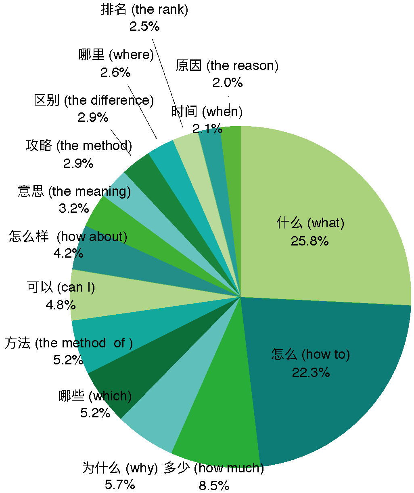

# ComQA:Compositional Question Answering via Hierarchical Graph Neural Networks [arxiv](https://arxiv.org/abs/2101.06400)

<p align="center">
    <br>
    
    <br>
</p>


## About the ComQA

**Com**positional **Q**uestion **A**nswering (ComQA), where the answer is composed of different and discontinuous parts from a document, is ubiquitous in current QA system. An example is shown below, where the answer is composed of two subtitles from the page and a sentence from the first paragraph, it makes the current span-extraction based machine reading comprehension system hard to apply:

<p align="center">
    <br>
    
    <br>
</p>  


We proposed a large scale QA dataset containing more than 200,000 compostional question answer pairs. The questions in ComQA are either from the user queries issued to the [Sogou Search](https://www.sogou.com/) or from the page title in a web page. We obtained nearly 300,000 web pages and employed the crowdworkers to annotated them. We develop a web based annotation interface and a snapshot is shown below. The answers are discontinuous nodes from the page's HTML.

<p align="center">
    <br>
    
    <br>
</p> 

Finally, we get nearly 230,000 question-answer pairs:

| Training data | Development Data | Test Data |
|:--:|:--:|:--:|
| 117,343  |5,000| 2,054 |

The questions in ComQA spans a large range of category such as medical, education, entertainment, etc.
<p align="center">
    <br>
    
    <br>
</p> 

You can obtain the ComQA data in the [`data`](https://github.com/benywon/ComQA/tree/main/data) directory (distributed under the CC BY-SA 4.0 <a rel="license" href="http://creativecommons.org/licenses/by-nc-sa/4.0/"></a> licence).

## Run the models

In this repository we provided four types of models for ComQA, i.e. the [BERT](https://arxiv.org/abs/1810.04805), our re-implemented BERT that fixed long sequence, [QANet](https://arxiv.org/abs/1804.09541), and our proposed hirachical graph neural networks.

**requirements**: You should install the [Nvidia Apex](https://github.com/NVIDIA/apex/) before running the code:

```
$ git clone https://github.com/NVIDIA/apex
$ cd apex
$ pip install -v --no-cache-dir --global-option="--cpp_ext" --global-option="--cuda_ext" --global-option="--fast_multihead_attn" ./
$ pip install -r requirements.txt
```


### **Training and evaluation**:

```bash
sh train_xxx.sh
```
where `xxx` stands for model name, such as bert. The bash scripts will first preporcess the data, and then run the training code. Finally, evaluation is conducted on the test set. An instance of the bert training in shown below.

```
#!/bin/bash
base_dir=`pwd`
jobname='bert for ComQA'
train_features_path=${base_dir}/data/train.bert.obj
dev_features_path=${base_dir}/data/dev.bert.obj
test_features_path=${base_dir}/data/test.bert.obj
model_save_path=${base_dir}/model/bert.comqa.base.th
echo $jobname
echo "start processing data"
echo $train_features_path
echo $dev_features_path
echo $test_features_path

cd process
python3 process_bert.py --train=${train_features_path} --dev=${dev_features_path} --test=${test_features_path}
cd ../train

echo "start training"
python3.6 -m torch.distributed.launch --nproc_per_node=4 bert.py \
--train_file_path=${train_features_path} \
--dev_file_path=${dev_features_path} \
--model_save_path=${model_save_path} \
--epoch=10 \
--pretrain_model=${base_dir}/model/bert.base.th

cd ../evaluation
echo "start evaluation"
python3 evaluate_bert.py ${test_features_path} ${model_save_path}
``` 

## Results

* Test set

|               | Precision | Recal |  F1  | Accuracy | BLUE-4 |
| :------------ | :-------: | :---: | :--: | :------: | :----: |
| LSTM          |   83.4    | 46.1  | 59.4 |   28.2   |  41.4  |
| QANet         |   71.6    | 62.4  | 66.3 |   35.7   |  48.8  |
| BERT_official |   81.1    | 66.2  | 72.9 |   38.4   |  54.9  |
| BERT_base     |   79.6    | 74.4  | 77.5 |   45.2   |  58.3  |
| BERT_large    |   80.4    | 75.5  | 78.3 |   47.3   |  61.2  |
| HGNN_base     |   80.2    | 75.4  | 78.0 |   46.2   |  60.7  |
| HGNN_large    |   81.3    | 76.9  | 79.6 |   48.3   |  61.9  |

## Citation
If you use ComQA in your research, please cite our work with the following BibTex Entry
```
@inproceedings{comqabingningwang,
  author    = {Bingning Wang and
               Ting Yao and
               Weipeng Chen and
               Jingfang Xu and
               Xiaochuan Wang},
  title     = {ComQA:Compositional Question Answering via Hierarchical Graph Neural Networks},
  booktitle = {The Web Conference 2021 (WWW2021)},  
  year      = {2021}
}
```

## License

<a rel="license" href="http://creativecommons.org/licenses/by-nc-sa/4.0/"></a><br />本作品采用<a rel="license" href="http://creativecommons.org/licenses/by-nc-sa/4.0/">知识共享署名-非商业性使用-相同方式共享 4.0 国际许可协议</a>进行许可。